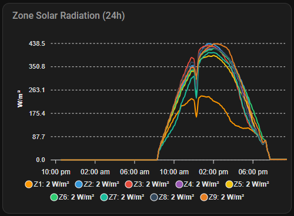
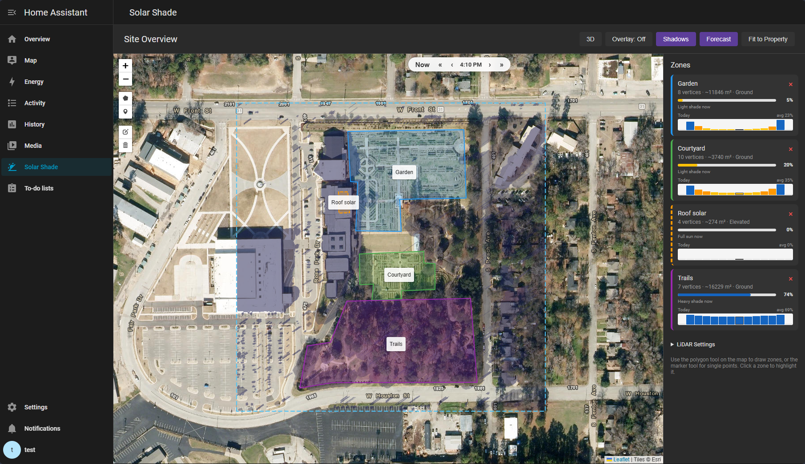
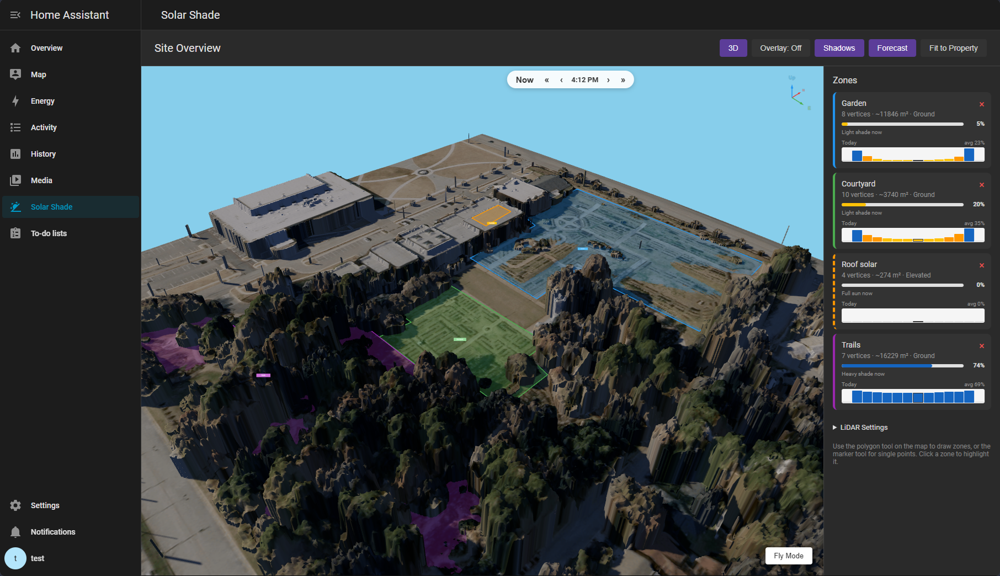
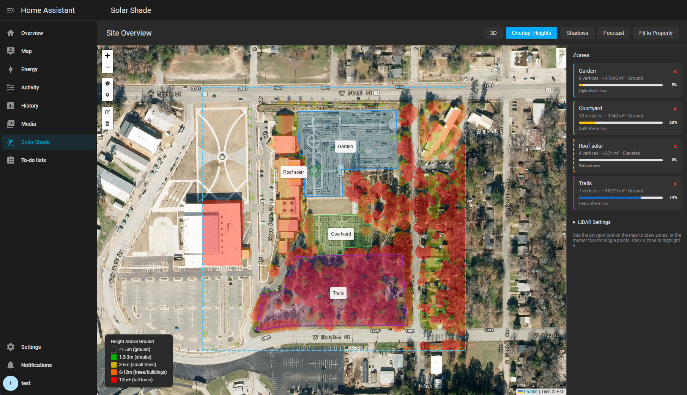
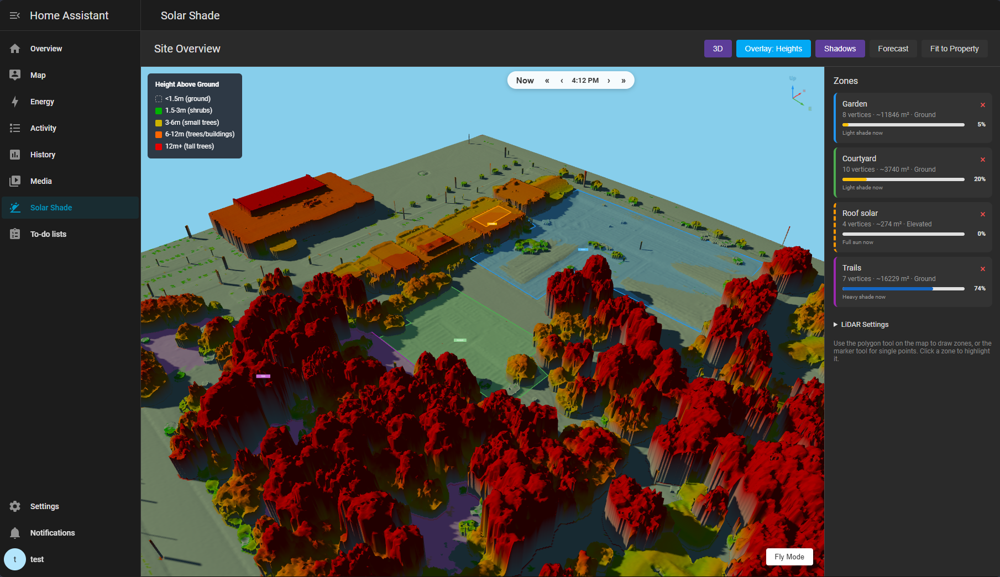
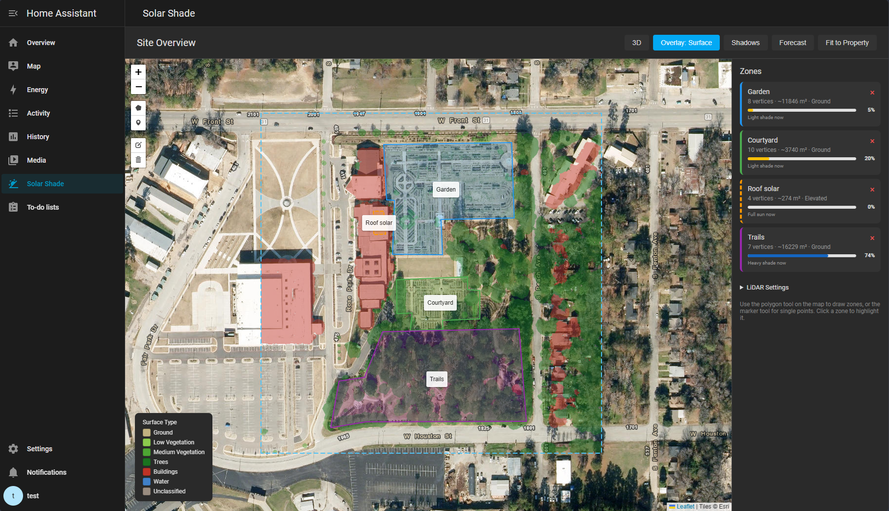
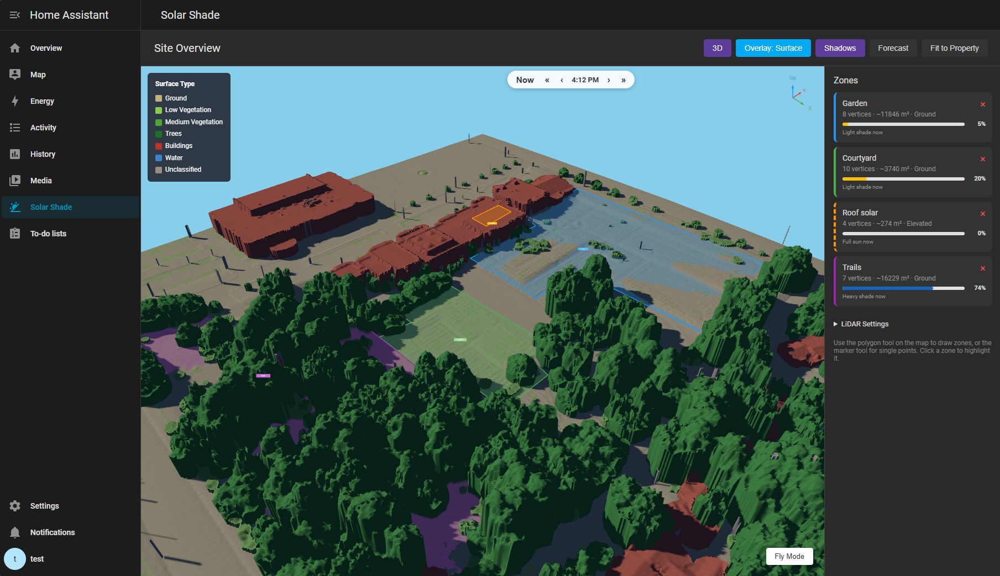

# Solar Shade

[](https://github.com/hacs/integration)
[](LICENSE)

Shadow and solar radiation tracking for Home Assistant, built on USGS LiDAR data.

## Use Cases

- **Smart Irrigation** — Feed shade-adjusted radiation to [Smart Irrigation](https://github.com/jeroenterheerdt/HAsmartirrigation). Shaded zones water less, sunny zones water more.
- **Solar Panels** — Track when panels are shaded by trees or buildings.
- **Blinds & Shades** — Close blinds when sun hits a window, open them when shaded.
- **HVAC** — Per-room shade data for smarter heating/cooling.
- **Shade Only** — Don't care about radiation? Just use `shade_fraction` (0.0–1.0) for any automation.

Each zone gets sensors with `shade_fraction`, `sun_azimuth`, `sun_elevation`, etc.

## What It Does

Point it at a radiation source (or use the built-in Open-Meteo feed) and it ray-traces shadows from LiDAR elevation data every few minutes:

```
Weather Solar Radiation --> Solar Shade --> sensor.solar_shade_front_lawn     (850 W/m²)
  +                                    --> sensor.solar_shade_back_yard_oak  (180 W/m²)
HA sun.sun position                    --> sensor.solar_shade_side_garden    (520 W/m²)
```

No radiation source? Each zone still reports shade fraction — enough for blinds, panels, whatever.



## Features

- Draw zones on satellite imagery, see them in 3D
- Overlay modes: Heights, Surface Type, live Shadows
- Daily shade forecast with sparkline charts per zone
- Shade methods: average, sunniest point, shadiest point
- Built-in Open-Meteo (no external sensor needed)
- Sun exposure sensors (100% = full sun, 0% = full shade)

## Quick Start

### 1. Install

**HACS**: Add as custom repository, install, restart HA.

**Manual**: Copy `custom_components/solar_shade/` to your config directory.

### 2. Add Integration

**Settings > Devices & Services > Add Integration > Solar Shade**. Confirm.

It downloads LiDAR data for your HA home location automatically. Open-Meteo is on by default, so radiation sensors work immediately.

### 3. Draw Zones

Open **Solar Shade** in the sidebar, draw polygons on the map, save. Done.

### 4. Check Your Data

Toolbar buttons:
- **Overlay** — cycle through Off / Heights / Surface Type
- **Shadows** — live shadow overlay with time scrubber
- **Forecast** — full-day shade forecast with sparklines
- **3D** — terrain viewer




### 5. Radiation Source (optional)

Open-Meteo is on by default (`sensor.solar_shade_shortwave_radiation`, `sensor.solar_shade_diffuse_radiation`).

Have a pyranometer or weather station? Switch to it in Configure (Settings > Devices & Services > Solar Shade > Configure).

### 6. Use It

Standard HA entities — use them in automations, scripts, dashboards, whatever.

**Smart Irrigation example:** For each zone, create a Sensor Group with solar radiation set to `sensor.solar_shade_<zone>`, and set Solrad behavior to "Do not estimate."

## How It Works

1. **Elevation data** — A DSM (Digital Surface Model) captures everything: trees, buildings, fences. A DTM (bare earth) gives ground heights. Both come from the same LiDAR point cloud.




2. **Shadow ray-tracing** — Each update cycle, the sun position from `sun.sun` is ray-traced across the DSM to compute shadows.

3. **Ground-level evaluation** — Shadows are checked at ground level (DTM), not canopy level. A zone under a tree is correctly reported as shaded.

4. **Raised canopy model** — Trees are modeled with a canopy top (highest LiDAR return) and canopy base (lowest non-ground return above trunk height). Light filters through the canopy with seasonal transmittance but passes freely through the trunk space below. When the laser only got one return (dense canopy, no penetration), that cell is a thin shell at treetop height.

5. **Per-zone calculation** — Each zone polygon is overlaid on the shadow map. Shaded pixel fraction drives the radiation adjustment.




6. **Surface-aware transmittance** — Different surfaces block different amounts of light:

| Surface Type | Transmittance | Notes |
|-------------|--------------|-------|
| Building | 0% | Opaque |
| High vegetation | 15–65% | Seasonal, latitude-dependent |
| Medium vegetation | 40% | Hedges, shrubs |
| Low vegetation | 60% | Grass, groundcover |
| Unclassified | 0% | Opaque |

Tree transmittance follows a sinusoidal seasonal curve. Tropical (< 23° lat) stays at 15% year-round. Temperate (> 35°) gets full swing. Subtropical blends. Southern hemisphere is flipped.

7. **Weather-responsive** — Cloudy days have low source radiation, so shade barely matters. Clear days, it matters a lot.

## LiDAR Data

### US Locations (automatic)

The integration hits the USGS National Map API, downloads the LAZ tile for your location, and rasterizes DSM + DTM from the point cloud. Grid resolution scales with point density automatically.

Options:
- Adjust download radius for larger properties
- Set a min cell size to trade detail for speed
- Use a manual LAZ file instead of auto-download

International: drop a LAZ/LAS file in `config/solar_shade/` and select "Manual LAZ file" in settings.

### Coverage

Most US metro and suburban areas. Check yours at [apps.nationalmap.gov/lidar-explorer](https://apps.nationalmap.gov/lidar-explorer/).

## Settings

All in Configure (Settings > Devices & Services > Solar Shade > Configure).

| Setting | Default | Description |
|---------|---------|-------------|
| Diffuse fraction | 0.15 | Fraction of radiation reaching fully shaded areas. 0.10–0.20 is typical |
| Min cell size | 0.5 m | Floor for auto grid resolution. Raise to 1–2m on slower hardware |
| Update interval | 5 min | Shadow recomputation frequency |
| Download radius | 50 m | USGS download area. Increase for larger properties |
| Min shadow height | 0.1 m | Ignore objects shorter than this |
| Shade method | Average | Per-zone: average, sunniest point, or shadiest point |
| Canopy model | Raised canopy | **Raised**: elevated canopy with trunk space underneath. **Solid**: opaque wall ground-to-treetop |
| Fill DSM gaps | Off | Interpolate missing elevation cells. Can help with sparse data but may cause artifacts at tree edges |
| Lat/long override | HA location | Override location for download and sun calc |
| Enable Open-Meteo | On | Built-in radiation source |

## Sensors

### Per-Zone Radiation
`sensor.solar_shade_<zone_name>` — Shade-adjusted W/m². Only exists when a radiation source is configured.

| Attribute | Description |
|-----------|-------------|
| `zone_name` | Zone name |
| `shade_fraction` | 0.0 = full sun, 1.0 = full shade |
| `raw_radiation` | Unadjusted source radiation (W/m²) |
| `sun_azimuth` | Sun azimuth |
| `sun_elevation` | Sun elevation |
| `shade_average` | Average shade across zone |
| `shade_sunniest` | Shade at sunniest point |
| `shade_shadiest` | Shade at shadiest point |
| `diffuse_fraction` | Configured diffuse fraction |

### Per-Zone Sun Exposure
`sensor.solar_shade_<zone_name>_sun` — 0–100% sun exposure. Always created.

| Attribute | Description |
|-----------|-------------|
| `zone_name` | Zone name |
| `shade_fraction` | 0.0 = full sun, 1.0 = full shade |
| `sun_azimuth` | Sun azimuth |
| `sun_elevation` | Sun elevation |

### Open-Meteo (optional)
`sensor.solar_shade_shortwave_radiation` and `sensor.solar_shade_diffuse_radiation` from Open-Meteo forecast data.

## Services

`solar_shade.reload_site` — Re-download elevation data and recompute shadows.

## Troubleshooting

| Problem | Fix |
|---------|-----|
| "No LAZ tiles found" | No USGS coverage at your location. Check [LiDAR Explorer](https://apps.nationalmap.gov/lidar-explorer/) |
| Slow download | LAZ tiles are 50–200MB. First run takes a few minutes |
| Rounded buildings in 3D | Try raising min cell size to 1.0m |
| No shadow overlay | Click the Shadows button. Check HA logs |
| USGS timeout | TNM API can be slow. Retries automatically. Try again later |

## Requirements

- Home Assistant 2024.1+
- HACS (recommended)
- US location with USGS LiDAR coverage, or a LAZ/LAS file
- `numpy`, `laspy`, `laszip` (installed automatically)
